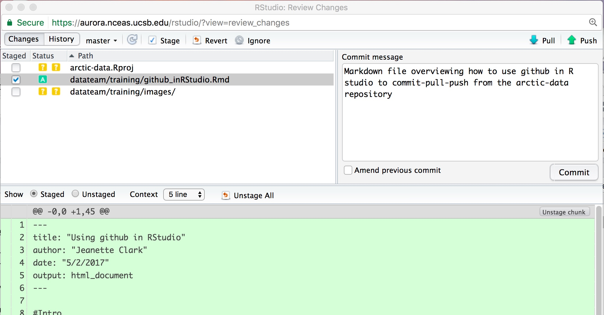

#Using git in RStudio

## Introduction

First, read the excellent intro to git put together by the eco-data-science group at UCSB/NCEAS. Don't worry too much about the forking and branching sections, as we will primarily be using the basic commit-pull-push commands.
[git intro](https://github.com/eco-data-science/github-intro-2/blob/master/index.pdf)

## So why do I need to use this again?

There are several reasons why using the arctic-data github is helpful, both for you and for the rest of the data team. Here are a few:

* **Versioning**: Accidentally make a change to your code and can't figure out why it broke? Wish you could go back to that version that worked? If you add your code to the github you can do this!
* **Reproducibility**: Being able to reproduce how you acomplished something is incredibly important. We should be able to tell anyone exactly how data have been reformatted, how metadata have been altered, and how packages have been created. This is especially important for us, as a data center, with interns that stay for 6-12 months, if we need to go back and figure out how something was done after the intern who wrote the code left.
* **Troubleshooting**: If you are building a particularly complicated EML, or doing some other advanced task, it is much easier for Jesse, Jeanette, or Bryce to troubleshoot your code if it is on the github. We can view, troubleshoot, and fix bugs very easily when code is on the github, with the added bonus of being able to go back a version if something should break.
* **Solve future problems**: Some of the issues we see in ADC submissions come up over and over again. When all of our code is on github, we can easily reference code built for other submissions, instead of trying to solve the same problems over and over again from scratch.

## Setting up git

Now you need to set up your git global options, and tell it who you are. At the top of your RStudio window, select Tools > Shell. In the prompt, you will need to run two commands, one at a time. The first tells git what your name is, the second what your email address is. These are the commands:

`git config --global user.name "My Name"`
`git config --global user.email myemail@domain.com`

After running these commands, the shell prompt should look like this:

## Cloning the arctic-data repo

Next, you need to clone the arctic-data repository to your RStudio. You do this by adding it as a "project." In your RStudio window, click File > New Project. Then click Version Control, and then select the Git option. If you are prompted to save your workspace during this process, make sure all of your work is saved, and you don't need anything in your environment, and then click 'Don't Save.' 

You should see a prompt asking you for a URL. Fill it out like this to clone the arctic-data repository into the top level of your home directory. Note that the URL is the same URL you use to view the repository on the web. If you are using the sasap-data repository, the URL is http://github.nceas.ucsb.edu/NCEAS/sasap-data/.

You will be prompted for your username and password, and then git will clone the directory. The username/password you use should be the same one you use to log in when you go to http://github.nceas.ucsb.edu/KNB/arctic-data. Now you should have a directory called arctic-data in your RStudio files window.

## Adding a new script to the github

If you have been working on a script that you want to put in the arctic-data github, you need to save it somewhere in the arctic-data folder you made in your account on the server. You can do this by either moving your script into the folder or using the save-as functionality. Note that git will try and version anything that you save in this folder, so you should be careful about what you save here. Things that probably shouldn't be saved in this folder, for our purposes include:

* **Tokens**: Any token file or script with a token in it should NOT be saved in the repository. Others could steal your login credentials if you put a token on the github.
* **Data files**: Git does not version data files very well. You shouldn't save any .csv's or any other data files (including metadata)
* **Workspaces/.RData**: If you are in the habit of saving your R workspace, you shouldn't save it in this directory
* **Plots/Graphics**: For the same reasons as data files

Note: Do not EVER make a commit that you don't understand. If something unexpected (like a file you have never worked on) shows up in your git tab, ask Jesse or Jeanette before committing.

After you save your script in the appropriate place within the arctic-data folder, it will show up in your git tab looking like this:

Before you commit your changes, you need to click the little box under "staged." Do not stage or commit any .Rproj file. After clicking the box for your file, click "Commit" to commit your changes. In the window that pops up (you may need to force the browser to allow pop-ups), you can write your commit message. Remember that the commit message should be a concise description of the changes being made to a file. Your window should look like this:

Push commit, and your commit will be saved. Now you want to merge the commits you made with the master version of the repository. You do this by using the command "push." Before you push, you need to pull though, always, to avoid merge conflicts. Click "pull" and type in your credentials. Then, assuming you don't have a merge conflict, you can push your changes by clicking "push."

Always remember, the order is **commit-pull-push**

## Editing Scripts

If you want to change a script, the workflow is the same. Just open the script that was saved in the arctic-data folder on your server account, make your changes, save the changes, stage them by clicking the box, commit, pull, then push to merge your version with the main version on the website. Do NOT edit scripts using the website. It is much easier to accidentally overwrite the history of a file this way.

One thing you might be wondering as you are working on a script is, how often should I be committing my changes? It might not make sense to commit-pull-push after every single tiny change - if only because it would slow you way down. Personally, I commit every time I feel that a significant change has happened and that the chunk of code I was working on is "done." Sometimes this is an entire script, other times it is just a few lines within a script. A good sign that you are committing too infrequently might be if many of your commit messages address a wide variety of coding tasks, such as: "wrote for loop to create referenced attribute lists for tables 1:20. also created nesting structure for this package with another package. also created attribute list for data table 40."

And one final note, you can make multiple commits before you push to the repo. If you are making lots of changes to the script, you might want to make several commits before pull-push. You can see how many commits you are ahead of the "origin/master" branch (i.e. what you see on the website) by looking for text in your git tab in RStudio that looks like this:

## Where do I commit?

The default right now is to save data-processing scripts in the `arctic-data/datateam/data-processing/` directory, with subfolders listed by project. Directories can be created as needed but please ask Jesse or Jeanette first so we can try and maintain some semblance of order in the file structure. 

## My Git tab disappeared

Sometimes R will crash so hard it loses your project information, causing your git tab to disappear. If this happens *anything you saved, but did not commit or push* in your arctic-data (or sasap-data) folder is no longer being tracked by github. To get the tab back, first, rename your old arctic-data folder to something else (like arctic-data_old). This will ensure that any work that you had in that folder that you didn't push to the master branch is not lost. Next, follow the steps above in "cloning the arctic-data repo" to re-clone the repository. Then, move whatever scripts or parts of scripts that were not being tracked into the arctic-data repo so that they are tracked again, and merge them back into the master branch.

Ideally, you are committing and pushing your scripts frequently enough that you don't have to resort to this. If you had changes you had committed but not pushed, you can still push these changes from the command line. See Jeanette for more info on how to do this if it is the case.

Remember: *commit, pull, push* frequently (at least once a day).
