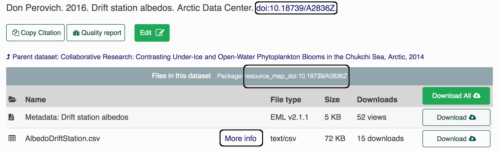

# Creating a data package

This chapter will teach you how to create and submit a data package to a DataONE MN via R. But first, please read [this paper](data/eml-principles.pdf) on the value of structured metadata, namely the Ecological Metadata Language (EML).

## What is in a package?

A data package generally consists of at least 3 "objects" or files. 

1. Metadata: One object is the metadata file itself. In case you are unfamiliar with metadata, metadata are information that describe data (e.g. who made the data, how were the data made, etc.). The metadata file will be in an XML format, and have the extension `.xml` (extensible markup language). We often refer to this file as the EML, which is the metadata standard that it uses.

2. Data: Other objects in a package are the data files themselves. Most commonly these are data tables (`.csv`), but they can also be audio files, NetCDF files, plain text files, PDF documents, image files, etc. 

3. Resource Map: The final object is the resource map. This object is a plain text file with the extension `.rdf` (<a href = 'https://www.w3.org/RDF/' target='_blank'>Resource Description Framework</a>) that defines the relationships between all of the other objects in the data package. It says things like "this metadata file describes this data file," and is critical to making a data package render correctly on the website with the metadata file and all of the data files together in the correct place. Fortunately, we rarely, if ever, have to actually look at the contents of resource maps; they are generated for us using tools in R.

## About identifiers

Each object (metadata files, data files, resource maps) on the ADC or the KNB (another repo) has a unique identifier, also sometimes called a "PID" (persistent identifier). When you look at the landing page for a data set, for example <a href = 'https://arcticdata.io/catalog/#view/doi:10.18739/A2836Z' target='_blank'>here</a>, you can find the resource map identifier listed under the title in the gray bar after the words "Files in this dataset Package:" (`resource_map_doi:10.18739/A2836Z`), the metadata identifier in the "General > Identifier" section of the metadata record or after the title with blue font (`doi:10.18739/A2836Z`), and the data identifier by clicking the "more info" link next to the data object, and looking at the "Online Distribution Info" section (`arctic-data.9546.1`).





Different versions of a package are linked together by what we call the "version chain" or "obsolescence chain". Making an update to a data package, such as replacing a data file, changing a metadata record, etc, will result in a new identifier for the new version of the updated object. When making changes to a package, always use the `arcticdatautils::update_object()` or `arcticdatautils::publish_update()` commands on the *latest versions* of all objects to ensure that the version chain is maintained.

## Upload a package

We will be using R to connect to the <a href = 'https://arcticdata.io/catalog/#data' target='_blank'>NSF Arctic Data Center (ADC)</a> data repository to push and pull edits. To identify yourself as an admin you will need to pass a 'token' into R. Do this by signing in to the ADC with your ORCid and password, then hovering over your name in the top right corner and clicking on "My profile", then navigating to "Settings" and "Authentication Token", copying the "Token for DataONE R", and finally pasting and running it in your R console.

**This token is your identity on these sites, please treat it as you would a password** (i.e. don't paste into scripts that will be shared). The easiest way to do this is to always run the token in the *console*. There's no need to keep it in your script since it's temporary anyway. Sometimes you'll see a placeholder in scripts to remind users to get their token, such as:

```{r token, message=FALSE, eval=FALSE}
options(dataone_test_token = "...")
```

Next, please be sure these packages are loaded:

```{r load libraries, message=FALSE, eval=FALSE}
library(devtools)
library(dataone)
library(datapack)
library(EML)
library(remotes)
library(XML)
```

If any package could not be loaded, use the following command (replacing package_name with the actual package name) to install the package, then load them.

```{r, eval = FALSE}
install.packages("package_name")
```

Now install a couple of packages:

```{r, eval = FALSE}
remotes::install_github("nceas/arcticdatautils")
library(arcticdatautils)
remotes::install_github("nceas/datamgmt")
library(datamgmt)
```

For this training, we will be working exclusively on the Arctic test site, or "node." In many of the functions you will use this will be the first argument. It is often referred to in documentation as `mn`, short for member node. Set the node to the test Arctic node:

``` {r, eval = FALSE, class.source = 'exercise'}
cn_staging <- CNode('STAGING')
adc_test <- getMNode(cn_staging,'urn:node:mnTestARCTIC')
```

```{r, child = '../workflows/edit_data_packages/publish_an_object.Rmd'}
```

```{r, child = '../workflows/edit_data_packages/create_a_resource_map.Rmd'}
```

## Exercise 2 {.exercise}

* Locate the data package you published in [Exercise 1](#exercise-1) by navigating to the "My Profile > My Data" section on <a href = 'https://test.arcticdata.io' target='_blank'>test.arcticdata.io</a>.
* Download the metadata and data files and transfer them to the Datateam server.
* Using the functions described in the section above, publish your metadata record and data file to the site. (When you do so, make sure you save the `PID`s to different variables in R...) i.e.

``` {r, eval = FALSE, class.source = 'exercise'}
data_pid <- publish_object(...)
metadata_pid <- publish_object(...)
```

* Then create a resource map containing your data and metadata.
* View your new data set (which is identical to the one you created previously) by appending the metadata PID to the end of the URL test.arcticdata.io/#view/... 
