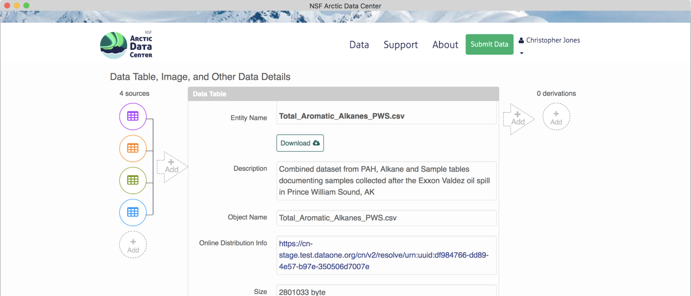

# Building provenance

**Note** - It is rare for a dataset to have provenance - though we would like to see that change by encouraging researchers to submit scripts whenever it is reasonable. When processing datasets if you notice that provenance is needed let Daphne or Jeanette know.

The provenance chain describes the origin and processing history of data. Provenance (or "prov") can exist on a continuum, ranging from prose descriptions of the history, to formal provenance traces, to fully executable environments. In this section we will describe how to build provenance using formal provenance traces in DataONE.

Provenance is becoming increasingly important in the face of what is being called a reproducibility crisis in science. J. P. A. Ioannidis (2005) wrote that “Most Research Findings Are False for Most Research Designs and for Most Fields”. Ioannidis outlined ways in which the research process has lead to inflated effect sizes and hypothesis tests that codify existing biases.

The first step towards addressing these issues is to be able to evaluate the data, analyses, and models on which conclusions are drawn. Under current practice, this can be difficult because data are typically unavailable, the method sections of papers do not detail the computational approaches used, and analyses and models are often conducted in graphical programs, or, when scripted analyses are employed, the code is not available.

And yet, this is easily remedied. Researchers can achieve computational reproducibility through open science approaches, including straightforward steps for archiving data and code openly along with the scientific workflows describing the provenance of scientific results (e.g., Hampton et al. (2015), Munafò et al. (2017)).

At NCEAS and in the datateam, not only do we archive data and code openly, but we also describe the workflows that involve that data and code using provenance, formalizing the provenance trace for a workflow that might look like this  into an easily understandable trace including archived data objects, such as what is shown <a href = 'https://goa.nceas.ucsb.edu/#view/urn:uuid:3249ada0-afe3-4dd6-875e-0f7928a4c171' target='_blank'>here</a>.

There are two ways that we add provenance in the datateam - the prov editor and the R `datapack` package.

## Using the prov editor

Provenance can easily be added to production Arctic Data Center packages using the provenance editor on the Arctic Data Center. On the landing page of a data package within beta, in the `dataTable` or `otherEntity` section where you would like to add a provenance relationship, you can choose to add either a "source" or a "derivation", to the left or right of the object pane, respectively. 


To add a source data file, click on the circle with the "+ add" text. Similarly, a source script would be added by selecting the arrow. Selecting the circle to add a source file pulls up the following screen, where you can select the source from other data objects within the same data package. 

A data package with an object that has multiple sources added will look like this. 

For simple packages on the Arctic Data Center, adding prov through the prov editor is super easy!

## Understanding resource maps

Before we dive further into constructing prov in R, we need to talk more about resource maps (or "resmaps").

All data packages have a single resource map. But what is a resource map and how do we use one to find out what objects are in a particular data package? This document is a short introduction but a more complete guide can be found <a href = 'https://releases.dataone.org/online/api-documentation-v2.0/design/DataPackage.html?highlight=resource%20map' target='_blank'>here</a>.

A resource map is a special kind of XML document that describes (among other things) an "aggregation". The aggregation describes the members of a data package (metadata and data, usually). We can use the `dataone` R package to download a resource map if we know its `PID`:

```{r, eval = F}
library(dataone)

d1c_test <- dataone::D1Client("STAGING", "urn:node:mnTestARCTIC")
pid <- "urn:uuid:82bd7d7f-9e18-4fd2-8bda-99b1fddab556" # A resource map PID

path <- tempfile(fileext = ".xml") # We're saving to a temporary file but you can save elsewhere
writeLines(rawToChar(getObject(d1c_test@mn, pid)), path) # Write the object to `path`
```

If we open that file up in a text editor, we see this:

```
<?xml version="1.0" encoding="utf-8"?>
<rdf:RDF xmlns:cito="http://purl.org/spar/cito/" xmlns:dc="http://purl.org/dc/elements/1.1/" xmlns:dcterms="http://purl.org/dc/terms/" xmlns:foaf="http://xmlns.com/foaf/0.1/" xmlns:ore="http://www.openarchives.org/ore/terms/" xmlns:prov="http://www.w3.org/ns/prov#" xmlns:provone="http://purl.dataone.org/provone/2015/01/15/ontology#" xmlns:rdf="http://www.w3.org/1999/02/22-rdf-syntax-ns#" xmlns:rdfs="http://www.w3.org/2000/01/rdf-schema#" xmlns:xsd="http://www.w3.org/2001/XMLSchema#">
  <rdf:Description rdf:about="https://cn.dataone.org/cn/v2/resolve/urn%3Auuid%3A61b48e72-ea29-4ba5-8131-4f59a9ebcd27">
    <cito:isDocumentedBy rdf:resource="https://cn.dataone.org/cn/v2/resolve/urn%3Auuid%3Ac59b7505-39e6-4def-bc82-b67a8d117ce5"/>
  </rdf:Description>
  <rdf:Description rdf:about="https://cn.dataone.org/cn/v2/resolve/urn%3Auuid%3A82bd7d7f-9e18-4fd2-8bda-99b1fddab556#aggregation">
    <rdf:type rdf:resource="http://www.openarchives.org/ore/terms/Aggregation"/>
  </rdf:Description>
  <rdf:Description rdf:about="https://cn.dataone.org/cn/v2/resolve/urn%3Auuid%3Ac59b7505-39e6-4def-bc82-b67a8d117ce5">
    <cito:isDocumentedBy rdf:resource="https://cn.dataone.org/cn/v2/resolve/urn%3Auuid%3Ac59b7505-39e6-4def-bc82-b67a8d117ce5"/>
  </rdf:Description>
  <rdf:Description rdf:about="https://cn.dataone.org/cn/v2/resolve/urn%3Auuid%3Ac59b7505-39e6-4def-bc82-b67a8d117ce5">
    <cito:documents rdf:resource="https://cn.dataone.org/cn/v2/resolve/urn%3Auuid%3A61b48e72-ea29-4ba5-8131-4f59a9ebcd27"/>
  </rdf:Description>
  <rdf:Description rdf:about="https://cn.dataone.org/cn/v2/resolve/urn%3Auuid%3Ac59b7505-39e6-4def-bc82-b67a8d117ce5">
    <cito:documents rdf:resource="https://cn.dataone.org/cn/v2/resolve/urn%3Auuid%3Ac59b7505-39e6-4def-bc82-b67a8d117ce5"/>
  </rdf:Description>
  <rdf:Description rdf:about="https://cn.dataone.org/cn/v2/resolve/urn%3Auuid%3A61b48e72-ea29-4ba5-8131-4f59a9ebcd27">
    <ore:isAggregatedBy rdf:resource="https://cn.dataone.org/cn/v2/resolve/urn%3Auuid%3A82bd7d7f-9e18-4fd2-8bda-99b1fddab556#aggregation"/>
  </rdf:Description>
  <rdf:Description rdf:about="https://cn.dataone.org/cn/v2/resolve/urn%3Auuid%3A82bd7d7f-9e18-4fd2-8bda-99b1fddab556#aggregation">
    <dc:title>DataONE Aggregation</dc:title>
  </rdf:Description>
  <rdf:Description rdf:about="https://cn.dataone.org/cn/v2/resolve/urn%3Auuid%3A82bd7d7f-9e18-4fd2-8bda-99b1fddab556">
    <dcterms:identifier rdf:datatype="http://www.w3.org/2001/XMLSchema#string">urn:uuid:82bd7d7f-9e18-4fd2-8bda-99b1fddab556</dcterms:identifier>
  </rdf:Description>
  <rdf:Description rdf:about="https://cn.dataone.org/cn/v2/resolve/urn%3Auuid%3A82bd7d7f-9e18-4fd2-8bda-99b1fddab556">
    <ore:describes rdf:resource="https://cn.dataone.org/cn/v2/resolve/urn%3Auuid%3A82bd7d7f-9e18-4fd2-8bda-99b1fddab556#aggregation"/>
  </rdf:Description>
  <rdf:Description rdf:about="https://cn.dataone.org/cn/v2/resolve/urn%3Auuid%3Ac59b7505-39e6-4def-bc82-b67a8d117ce5">
    <ore:isAggregatedBy rdf:resource="https://cn.dataone.org/cn/v2/resolve/urn%3Auuid%3A82bd7d7f-9e18-4fd2-8bda-99b1fddab556#aggregation"/>
  </rdf:Description>
  <rdf:Description rdf:about="https://cn.dataone.org/cn/v2/resolve/urn%3Auuid%3A82bd7d7f-9e18-4fd2-8bda-99b1fddab556#aggregation">
    <ore:aggregates rdf:resource="https://cn.dataone.org/cn/v2/resolve/urn%3Auuid%3A61b48e72-ea29-4ba5-8131-4f59a9ebcd27"/>
  </rdf:Description>
  <rdf:Description rdf:about="https://cn.dataone.org/cn/v2/resolve/urn%3Auuid%3A82bd7d7f-9e18-4fd2-8bda-99b1fddab556#aggregation">
    <ore:aggregates rdf:resource="https://cn.dataone.org/cn/v2/resolve/urn%3Auuid%3Ac59b7505-39e6-4def-bc82-b67a8d117ce5"/>
  </rdf:Description>
  <rdf:Description rdf:about="https://cn.dataone.org/cn/v2/resolve/urn%3Auuid%3A82bd7d7f-9e18-4fd2-8bda-99b1fddab556">
    <rdf:type rdf:resource="http://www.openarchives.org/ore/terms/ResourceMap"/>
  </rdf:Description>
  <rdf:Description rdf:about="https://cn.dataone.org/cn/v2/resolve/urn%3Auuid%3A61b48e72-ea29-4ba5-8131-4f59a9ebcd27">
    <dcterms:identifier rdf:datatype="http://www.w3.org/2001/XMLSchema#string">urn:uuid:61b48e72-ea29-4ba5-8131-4f59a9ebcd27</dcterms:identifier>
  </rdf:Description>
  <rdf:Description rdf:about="https://cn.dataone.org/cn/v2/resolve/urn%3Auuid%3Ac59b7505-39e6-4def-bc82-b67a8d117ce5">
    <dcterms:identifier rdf:datatype="http://www.w3.org/2001/XMLSchema#string">urn:uuid:c59b7505-39e6-4def-bc82-b67a8d117ce5</dcterms:identifier>
  </rdf:Description>
</rdf:RDF>
```

Whoa! What is this thing and how do you read it to find the members of the data package? The short answer is to look for lines like this:

```
<rdf:Description rdf:about="https://cn.dataone.org/cn/v2/resolve/urn%3Auuid%3A82bd7d7f-9e18-4fd2-8bda-99b1fddab556#aggregation">
    <ore:aggregates rdf:resource="https://cn.dataone.org/cn/v2/resolve/urn%3Auuid%3Ac59b7505-39e6-4def-bc82-b67a8d117ce5"/>
```

This line says "The aggregation aggregates `urn:uuid:c59b7505-39e6-4def-bc82-b67a8d117ce5`" so that means `urn:uuid:c59b7505-39e6-4def-bc82-b67a8d117ce5` is in our data package! The key bit is the `<rdf:Description rdf:about="...#aggregation` part. If you look for another similar statement, you'll also see that `urn:uuid:61b48e72-ea29-4ba5-8131-4f59a9ebcd27` is part of our data package.

Now we know *which* objects are in our data package but we don't know which one contains metadata and which one contains data. For that, we need to get a copy of the system metadata for each object:

```{r, eval=FALSE}
getSystemMetadata(d1c_test@mn, "urn:uuid:c59b7505-39e6-4def-bc82-b67a8d117ce5")@formatId
getSystemMetadata(d1c_test@mn, "urn:uuid:61b48e72-ea29-4ba5-8131-4f59a9ebcd27")@formatId
```

From the `formatId`s, we can see the first `PID` is the EML (`formatId`: `[1]"eml://ecoinformatics.org/eml-2.1.1"`) and the second `PID` is a data object (`formatId`: `[1]"application/octet-stream"`). Now we know enough to know what's in the data package:

* Resource map: `urn:uuid:82bd7d7f-9e18-4fd2-8bda-99b1fddab556`
* Metadata: `urn:uuid:c59b7505-39e6-4def-bc82-b67a8d117ce5`
* Data: `urn:uuid:61b48e72-ea29-4ba5-8131-4f59a9ebcd27`

Now that you've actually seen a resource map, we can dive further into prov.

## Using the `datapack` package

For packages not on the ADC, or packages that are extremely complicated, it may be best to upload prov relationships using R. The `datapack` package has several functions which help add relationships in a very simple way. These relationships are stored in the resource map. When you update a package to only add prov, the package will not be assigned any new identifiers **with the exception of the resource map**.

First, we set the environment, in a similar, but slightly different way than what you may be used to. Here the function `D1Client()` sets the DataONE client with the coordinating node instance as the first argument, and member node as the second argument.

```{r, eval = F, warning=F, message = F}
library(dataone)
library(datapack)
d1c <- D1Client("STAGING2", "urn:node:mnTestKNB")
```

Next, get the `PID` of the resource map of the data package you are adding prov to, and load that package into R using the `getDataPackage()` function.

```{r, eval = F}
packageId <- "urn:uuid:8f501606-2c13-4454-b22d-050a4176a97b"
dp <- getDataPackage(d1c, id=packageId, lazyLoad=TRUE, limit="0MB", quiet=FALSE)
```

Printing `pkg` in your console shows you the contents of the data package, including all of the objects and their names:

```
> pkg
Members:

filename   format         mediaType  size     identifier                                    modified local 
esc...er.R application/R  NA         888      knb.92049.1                                   n        n     
PWS....csv text/csv       NA         1871469  knb.92050.1                                   n        n     
PWS....csv text/csv       NA         1508128  knb.92051.1                                   n        n     
NA         eml:/...-2.1.1 NA         15658    urn:uuid:8f501606-2c13-4454-b22d-050a4176a97b n        y     

Package identifier: resource_map_urn:uuid:8f501606-2c13-4454-b22d-050a4176a97b
RightsHolder: http://orcid.org/0000-0002-2192-403X
```

It will also show the existing relationships in the resource map, which in this case are mostly the "documents" relationships that specify that the metadata record is describing all of these data files.

```
Relationships:
                                   subject           predicate                                   object
2          esc_reformatting_PWSweirTower.R cito:isDocumentedBy urn:uuid:8f501606-...4-b22d-050a4176a97b
4                        PWS_weirTower.csv cito:isDocumentedBy urn:uuid:8f501606-...4-b22d-050a4176a97b
1                PWS_Weir_Tower_export.csv cito:isDocumentedBy urn:uuid:8f501606-...4-b22d-050a4176a97b
3 urn:uuid:8f501606-...4-b22d-050a4176a97b     dcterms:creator                    _r1515542097r415842r1
5 urn:uuid:8f501606-...4-b22d-050a4176a97b      cito:documents          esc_reformatting_PWSweirTower.R
6 urn:uuid:8f501606-...4-b22d-050a4176a97b      cito:documents                        PWS_weirTower.csv
7 urn:uuid:8f501606-...4-b22d-050a4176a97b      cito:documents                PWS_Weir_Tower_export.csv
8 urn:uuid:8f501606-...4-b22d-050a4176a97b      cito:documents urn:uuid:8f501606-...4-b22d-050a4176a97b
9 urn:uuid:8f501606-...4-b22d-050a4176a97b cito:isDocumentedBy urn:uuid:8f501606-...4-b22d-050a4176a97b
```

In this example above, the data package has two .csv files, with an R script that converts one to the other. To create our provenance trace, first we need to select the source object, and save the `PID` to a variable. We do this using the `selectMember()` function, and we can query part of the system metadata to select the file that we want. This function takes the data package (`pkg`), the name of the sysmeta field to query (in this case we use the `fileName`), and the value that you want to match that field to (in this case, 'PWS_Weir_Tower_export.csv').

```{r, eval = F}
sourceObjId <- selectMember(dp, name="sysmeta@fileName", value='PWS_Weir_Tower_export.csv')
```

This returns a list of the source object `PID`s that match the query (in this case only one object matches).

```
> sourceObjId
[1] "knb.92051.1"
```

Now we need to select our output object. Here, we use the `selectMember()` function again, and save the result to a new variable.

```{r, eval=F}
outputObjId <- selectMember(dp, name="sysmeta@fileName", value='PWS_weirTower.csv')
```

Now we query for the R script. In this case, we query based on the value of the `formatId` as opposed to the `fileName`. This can be useful if you wish to select a large list of `PID`s that are all similar.

```{r, eval=F}
programObjId <- selectMember(dp, name="sysmeta@formatId", value="application/R")
```

Next, you use these lists of `PID`s and a function called `describeWorkflow()` to add these relationships to the data package. Note that if you do not have a program in the workflow, or a source file, you can simply leave those arguments blank.

```{r, eval = F}
dp <- describeWorkflow(dp, sources=sourceObjId, program=programObjId, derivations=outputObjId)
```

Viewing `pkg` again confirms that these relationships have been inserted into the data package, as shown by the `wasDerivedFrom` and `wasGeneratedBy` statements. It is always a good idea to print `pkg` to confirm that your `PID` selection process worked as expected, and your prov relationships make sense.

```
Relationships (updated):

                                subject                 predicate                               object
15 _1db49d06-ae98-4...9101-39f7c0b45a95                  rdf:type                     prov:Association
14 _1db49d06-ae98-4...9101-39f7c0b45a95              prov:hadPlan      esc_reformatting_PWSweirTower.R
1       esc_reformatting_PWSweirTower.R       cito:isDocumentedBy urn:uuid:8f50160...b22d-050a4176a97b
16      esc_reformatting_PWSweirTower.R                  rdf:type                      provone:Program
8                     PWS_weirTower.csv       cito:isDocumentedBy urn:uuid:8f50160...b22d-050a4176a97b
11                    PWS_weirTower.csv                  rdf:type                         provone:Data
20                    PWS_weirTower.csv       prov:wasDerivedFrom            PWS_Weir_Tower_export.csv
19                    PWS_weirTower.csv       prov:wasGeneratedBy urn:uuid:3dd59b0...bc38-3b5d8fa644ac
6             PWS_Weir_Tower_export.csv       cito:isDocumentedBy urn:uuid:8f50160...b22d-050a4176a97b
10            PWS_Weir_Tower_export.csv                  rdf:type                         provone:Data
9                 _r1515544826r415842r1                 foaf:name                     DataONE R Client
17 urn:uuid:3dd59b0...bc38-3b5d8fa644ac        dcterms:identifier urn:uuid:3dd59b0...bc38-3b5d8fa644ac
13 urn:uuid:3dd59b0...bc38-3b5d8fa644ac                  rdf:type                    provone:Execution
12 urn:uuid:3dd59b0...bc38-3b5d8fa644ac prov:qualifiedAssociation _1db49d06-ae98-4...9101-39f7c0b45a95
18 urn:uuid:3dd59b0...bc38-3b5d8fa644ac                 prov:used            PWS_Weir_Tower_export.csv
5  urn:uuid:8f50160...b22d-050a4176a97b            cito:documents      esc_reformatting_PWSweirTower.R
4  urn:uuid:8f50160...b22d-050a4176a97b            cito:documents                    PWS_weirTower.csv
3  urn:uuid:8f50160...b22d-050a4176a97b            cito:documents            PWS_Weir_Tower_export.csv
2  urn:uuid:8f50160...b22d-050a4176a97b            cito:documents urn:uuid:8f50160...b22d-050a4176a97b
7  urn:uuid:8f50160...b22d-050a4176a97b       cito:isDocumentedBy urn:uuid:8f50160...b22d-050a4176a97b
```

Finally, you can upload the data package using the `uploadDataPackage()` function, which takes the DataONE client `d1c` we set in the beginning, the updated `pkg` variable, some options for public read, and whether or not informational messages are printed during the upload process. **First, you will need to run a token obtained from https://dev.nceas.ucsb.edu/ to publish to that node.**

```{r, eval = FALSE}
resmapId_new <- uploadDataPackage(d1c, dp, public = TRUE, quiet = FALSE)
```

If successful you should be able to navigate to the landing page of your dataset, and icons should show up where the sources and derivations are, such as in this example: 

### Fixing mistakes

If you messed up updating a data package using `datapack`, there unfortunately isn't a great way to undo your work, as the `describeWorkflow()` only adds prov relationships, it does not replace them. If you messed up, the best course of action is to update the resource map with a clean version that does not have prov using `update_resource_map()`, and then go through the steps outlined above again.

Note: this has not been thoroughly tested, and more extreme actions may be necessary to fully nuke the prov relationships. Consult Peter or Jeanette if things do not work as expected.

## References

Ioannidis, John P A. 2005. “Why Most Published Research Findings Are False.” PLoS Medicine 2 (8): e124. https://doi.org/10.1371/journal.pmed.0020124.

Hampton, Stephanie E, Sean Anderson, Sarah C Bagby, Corinna Gries, Xueying Han, Edmund Hart, Matthew B Jones, et al. 2015. “The Tao of Open Science for Ecology.” Ecosphere 6 (July). https://doi.org/10.1890/ES14-00402.1.

Munafò, Marcus R., Brian A. Nosek, Dorothy V. M. Bishop, Katherine S. Button, Christopher D. Chambers, Nathalie Percie du Sert, Uri Simonsohn, Eric-Jan Wagenmakers, Jennifer J. Ware, and John P. A. Ioannidis. 2017. “A Manifesto for Reproducible Science.” Nature Human Behaviour 1 (1): 0021. https://doi.org/10.1038/s41562-016-0021.
