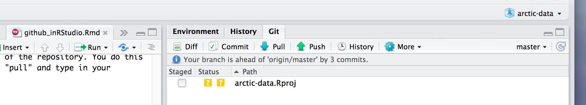

# Using Git

## Usage in the datateam

We use git and Github to manage our packages (ie datamgmt, arcticdatautils) and even this document!

## What is Git?

<a href="https://git-scm.com/" target = "_blank">Git</a> is a distributed version control system.

Important! If you have never used Git before, or only used it a little, or have no idea what it is, check out this <a href = 'https://github.com/eco-data-science/github-intro-2/blob/master/index.pdf' target='_blank'>intro to Git</a> put together by the ecodatascience group at UCSB. Don't worry too much about the forking and branching sections, as we will primarily be using the basic commit-pull-push commands. After you have read through that presentation, come back to this chapter.

### So why do I need to use this again?

There are several reasons why using the arctic-data GitHub repository is helpful, both for you and for the rest of the data team. Here are a few:

-   **Versioning**: Did you accidentally make a change to your code and can't figure out why it broke? Do you wish you could go back to the version that worked? If you add your code to the GitHub repo you can do this!
-   **Reproducibility**: Being able to reproduce how you accomplished something is incredibly important. We should be able to tell anyone exactly how data have been reformatted, how metadata have been altered, and how packages have been created. As a data center, this is especially important for us with data team members that stay for 6-12 months because we may need to go back and figure out how something was done after the intern or fellow who wrote the code left the team.
-   **Troubleshooting**: If you are building a particularly complicated EML, or doing some other advanced task, it is much easier for others to help you troubleshoot your code if it is on the GitHub repo. We can view, troubleshoot, and fix bugs very easily when code is on the GitHub repo, with the added bonus of being able to go back a version if something should break.
-   **Solve future problems**: Some of the issues we see in ADC submissions come up over and over again. When all of our code is on GitHub, we can easily reference code built for other submissions, instead of trying to solve the same problems over and over again from scratch.

## Setting up Git

Before using git, you need to tell it who you are. The only way to do this is through the command line. When you open RStudio, you should see a Terminal tab located to the right of the Console tab. If the Terminal tab is not visible, you can open it by selecting Tools -\> Terminal -\> New Terminal at the top of your RStudio window.

To tell git who you are, you're going to set the global options. This includes setting your name, email address, PAT (Personal Access Token), and caching the PAT. Make sure you run the following commands one at a time.

Type the following command in the Terminal window, with your actual name, and press enter. If you do this correctly, it will look as though **nothing** happened.

```{r, eval = FALSE}
git config --global user.name "Your Name"
```

Next, enter the following line, with the email address associated with your GitHub account. 

```{r, eval = FALSE}
git config --global user.email MyEmail@domain.com
```

After running these commands, the Terminal window should look like this: 

Next, we will tell Git to store your PAT. We must do this because of the way our server operating system handles credentials. If you don't run the next line, your PAT will expire immediately on the server, even though we will set it up on GitHub to be valid for 90 days.

```{r, eval = FALSE}
git config --global credential.helper 'cache -- timeout=10000000'
```

Finally, check to make sure everything looks correct by entering the following command, which will return the options that you have set.

```{r, eval = FALSE}
git config --global --list
```

## GitHub Authentication

GitHub recently deprecated password authentication for accessing repositories, so we need to set up a secure way to authenticate. That's where the PAT comes in. 

In the tabs at the bottom of your RStudio window, make sure to switch from the **Terminal** to the **Console**. Now that, you've done that, follow these steps:

1.    Run `usethis::create_github_token()`
2.    In the browser window that pops up, log into GitHub
3.    In the "Expiration" drop down menu, select "90 days"
4.    Click "Generate token" in the green box at the bottom of the page
5.    On the next page, copy the token from the green box
6.    Back in RStudio, run `credentials::set_github_pat()`
7.    Paste your token into the dialog box that pops up

You've now successfully set your PAT in RStudio, and connected R, Git, and GitHub. Great job! Now, you're going to clone the repository we work in so that you can version control your code.

### Cloning the arctic-data repo

To clone the arctic-data repository, navigate to the repository on GitHub: <https://github.nceas.ucsb.edu/KNB/arctic-data/>.


If you are not already logged on, this will be the enterprise account you use to log in when you go to RT. If you have trouble with this, send a message to Nick Outin (@Nick) in the datateam slack channel. 

Once you are logged on and can view the above link, click on the green "Code" button, and copy the URL in the gray box. 

In your RStudio window, click File -\> New Project -\> Version Control -\> Git. Paste the URL you just copied into the "Repository URL" box, and press tab on your keyboard. This should autofill the "Project directory name." If it does not, then type in `arctic-data`. Fill it out as shown in the image below to clone the arctic-data repository into the top level of your home directory. Click "Create Project," and now you should have a directory called arctic-data in your RStudio files window.

If you are prompted to save your workspace during this process, make sure all of your work is saved, and you don't need anything in your environment, and then click 'Don't Save'.


## Working with the repository

### Adding a new script

If you have been working on a script that you want to put in the arctic-data GitHub repo, you first need to save it somewhere in the arctic-data folder you cloned to your account on the Datateam server. You can do this by either moving your script into the folder or using the save-as functionality. Note that Git will try and version anything that you save in this folder, so you should be careful about what you save here. For our purposes, things that probably shouldn't be saved in this folder include:

-   **Tokens**: Any token file or script with a token in it should NOT be saved in the repository. Others could steal your login credentials if you put a token in GitHub.
-   **Data files**: Git does not version data files very well. You shouldn't save any .csv files or any other data files (including metadata).
-   **Workspaces/.RData**: If you are in the habit of saving your R workspace, you shouldn't save it in this directory.
-   **Plots/Graphics**: For the same reasons as data files.

```{block, type = "note"}
Note: Do not EVER make a commit that you don't understand. If something unexpected (like a file you have never worked on) shows up in your Git tab, ask for help before committing.
```

After you save your script in the appropriate place within the arctic-data folder, it will show up in your Git tab looking like this: 

Before you commit your changes, you need to click the little box under "Staged". Do not stage or commit any .Rproj file. After clicking the box for your file, click "Commit" to commit your changes. In the window that pops up (you may need to force the browser to allow pop-ups), write your commit message. *Always* include a commit message. Remember that the commit message should be a concise description of the changes that were made to a file. Your window should look like this: 

Push 'Commit', and your commit will be saved to your local repository (this will not push it to the remote repository, yet). Now you want to merge the commits you made with the master version of the remote repository. You do this by using the command "Push." But before you push, you *always* need to pull first to avoid merge conflicts. Pulling will merge the current version of the remote repository with your local repository, on your local machine. Click "Pull" and type in your credentials. Then, assuming you don't have a merge conflict, you can push your changes by clicking "Push".

Always remember, the order is **commit-pull-push**.

### Editing a script

If you want to change a script, the workflow is the same. Just open the script that was saved in the arctic-data folder on your server account, make your changes, save the changes, stage them by clicking the box, commit, pull, then push to merge your version with the main version on the website. Do NOT edit scripts using the GitHub website. It is much easier to accidentally overwrite the history of a file this way.

One thing you might be wondering as you are working on a script is, how often should I be committing my changes? It might not make sense to commit-pull-push after every single tiny change - if only because it would slow you way down. Personally, I commit every time I feel that a significant change has happened and that the chunk of code I was working on is "done". Sometimes this is an entire script, other times it is just a few lines within a script. A good sign that you are committing too infrequently might be if many of your commit messages address a wide variety of coding tasks, such as: "wrote for loop to create referenced attribute lists for tables 1:20. also created nesting structure for this package with another package. also created attribute list for data table 40".

One final note, you can make multiple commits before you push to the repo. If you are making lots of changes to the script, you might want to make several commits before pull-push. You can see how many commits you are ahead of the "origin/master" branch (i.e. what you see on the website) by looking for text in your Git tab in RStudio that looks like this: 

### Where do I commit?

The default right now is to save data-processing scripts in the `arctic-data/datateam/data-processing/` directory, with sub-folders listed by project. Directories can be created as needed but please ask Dom or Jesse first so we can try and maintain some semblance of order in the file structure.

The Github workflow diagram from <a href = 'https://www.reddit.com/r/git/comments/99ul9f/git_workflow_diagram_showcasing_the_role_of/' target='_blank'>stamminator</a> shows each step and their functions explicitly.


## My Git tab disappeared

Sometimes R will crash so hard it loses your project information, causing your Git tab to disappear. Most likely, RStudio has just closed your "project" and all you need to do is reopen it. If your Git tab has disappeared, in the top right of your RStudio session, you should see a little R logo with "Project: (None)" next to it. This means you do not currently have a project open. Clicking the arrow should give you a dropdown menu of recent projects, where you can select "arctic-data" or "sasap-data." Once you have opened your project, the Git tab should reappear! This is also a convenient way to switch between projects if you are working in multiple repositories.
