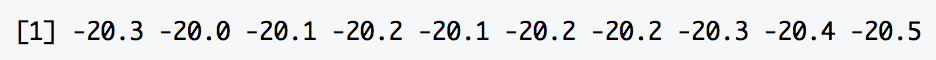

## netCDFs

This section is for dealing with netCDF (.nc) files. These files require data tables but since they can not be simply opened on the computer using a text editor or Excel, you can use Panoply to explore them or these R commands:

```{r, eval=FALSE}
library(arcticdatautils)
library(ncdf4)
filepath <- '/home/.../ICECAPS_precip_product_2010_2015.nc' 

# gets attribute info
atts <- get_ncdf4_attributes(filepath)
# preview of View(atts)
atts[1:10,]
```


```{r, eval=FALSE}
# returns the actual values for a specified attribute
t <- nc_open(filepath)
test <- ncvar_get(t, 't2m')
# preview of View(test)
test[1:10]
```



The `formatId` in the sysmeta will most likely be `netCDF-4`.
